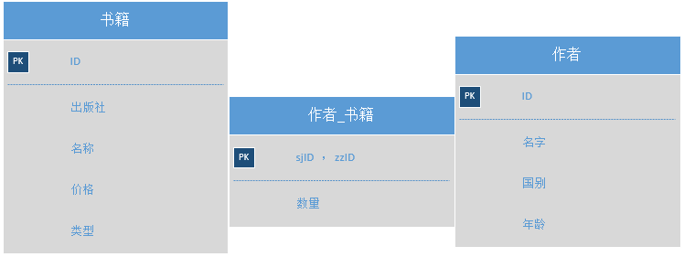

# 知识图谱构建规范 #
## 元本体构建规范 ##
### 元本体功能 ###
 + 集成多个知识源
 + 方便知识源的选择以及查询的构造
### 元本体词汇表 ###

		注1：带有问号的字符串表示变量
		注2：这是规范的0.1版本

 + 类
	 + meta:?class  rdf:type  owl:Class.
 + 数据类型属性
	 + meta:?dp  rdf:type  owl:DatatypeProperty.
 + 对象属性
	 + meta:?op  rdf:type  owl:ObjectProperty.
 + 实例
	 + rdb:?ins  rdf:type  owl:NamedIndividual.
	 + rdb:?ins  rdf:type  meta:?class.
 + 类层次
	 + meta:?class1  rdfs:subClassOf  meta:?class2.
 + 属性层次
	 + meta:?pro1  rdfs:subPropertyOf  meta:?pro2
 + 描述信息
	 + 可读名称: (rdb:?ins | meta:?class | meta:?pro)  rdfs:label  ?Str.
	 + 定义描述: (meta:?class | meta:?pro)  rdfs:comment  ?Str.
	 + 典型实例:  meta:?class  rdfs:isDefinedBy  meta:?ins.
 + 建模信息
	 + meta:blankNode  rdf:type  owl:Class.
	 + meta:实例  rdf:type  owl:ObjectProperty.
	 + meta:实例  rdfs:domain  meta:blankNode.
	 + meta:数量  rdf:type  owl:DatatypeProperty.

## RDB2RDF映射规则 ##

		注1：这是将28所核心数据库知识源转换为RDF格式的规则(0.1版本)
		注2：带有问号的字符串表示变量

总命名空间:

		@prefix rdb:<http://kse.seu.edu.cn/rdb#>

为了使此规则说明更容易理解，辅助以一个数据库例子来说明(该例子数据为假数据)。

### 数据库:图书 ###

其中作者_书籍表有联合主键 sjID和zzID.

### 有单一主键的实体表 ###

首先根据构建好的**单主键实体表名列表文件**找出所有的单主键实体表。关系型数据库中的每个实体表存储了一类实体的集合，这与RDF中Class的概念在直觉上非常类似，根据这种直觉制定以下映射规则:

#### 1.对表名的处理 ####

 + (模式层)表名作为类名，数据库中，书籍表和作者表都是实体表
	 + rdb:图书.书籍  rdf:type  owl:Class
	 + rdb:图书.作者  rdf:type  owl:Class

#### 2.对表字段的处理 ####

**注：**对于表字段的处理是比较复杂的，因为有些字段描述的是主语和宾语之间的数据类型属性关系，如图书表中的“名称”字段；有些字段描述的是主语和宾语之间的对象属性关系，如作者表中的“国别”字段；还有些字段描述了主语所属的类别，比如图书表中的“类型”字段，利用**字段判别文件**对这些字段进行分辨。

 + (模式层)字段作为**数据类型属性**(属性range依据对应数据库字段的数据类型指定)
	+ 图书.书籍.ID
		+ rdb:图书.书籍.ID  rdf:type  owl:DatatypeProperty
		+ rdb:图书.书籍.ID  rdfs:domain  rdb:图书.书籍
		+ rdb:图书.书籍.ID  rdfs:range  xsd:integer
	+ 图书.书籍.名称
		+ rdb:图书.书籍.名称  rdf:type  owl:DatatypeProperty
		+ rdb:图书.书籍.名称  rdfs:domain  rdb:图书.书籍
		+ rdb:图书.书籍.名称  rdfs:range  xsd:string
	+ 图书.书籍.价格
		+ rdb:图书.书籍.价格  rdf:type  owl:DatatypeProperty
		+ rdb:图书.书籍.价格  rdfs:domain  rdb:图书.书籍
		+ rdb:图书.书籍.价格  rdfs:range  xsd:integer
	+ 图书.作者.ID
		+ rdb:图书.作者.ID  rdf:type  owl:DatatypeProperty
		+ rdb:图书.作者.ID  rdfs:domain  rdb:图书.作者
		+ rdb:图书.作者.ID  rdfs:range  xsd:integer
	+ 图书.作者.名字
		+ rdb:图书.作者.名字  rdf:type  owl:DatatypeProperty
		+ rdb:图书.作者.名字  rdfs:domain  rdb:图书.作者
		+ rdb:图书.作者.名字  rdfs:range  xsd:string
	+ 图书.作者.年龄
		+ rdb:图书.作者.年龄  rdf:type  owl:DatatypeProperty
		+ rdb:图书.作者.年龄  rdfs:domain  rdb:图书.作者
		+ rdb:图书.作者.年龄  rdfs:range  xsd:integer
 + (模式层)字段作为**对象属性**:首先**以该字段名定义新类**(具体实现时需要保证一个数据库中这样定义出的新类不重复)，并解析该类的实例暂存于内存中，然后定义该字段为对象属性，指定其range
	 + 图书.书籍.出版社
		 + rdb:图书.出版社  rdf:type  owl:Class
		 + rdb:图书.书籍.出版社  rdf:type  owl:ObjectProperty
		 + rdb:图书.书籍.出版社  rdfs:range  meta:blankNode
		 + (实例层，但在构建模式层时便生成)实例数据
			 + rdb:图书.出版社.机械工业出版社  rdf:type  rdb:图书.出版社
			 + rdb:图书.出版社.人民邮电出版社  rdf:type  rdb:图书.出版社
	 + 图书.作者.国别
		 + rdb:图书.国别  rdf:type  owl:Class
		 + rdb:图书.作者.国别  rdf:type  owl:ObjectProperty
		 + rdb:图书.作者.国别  rdfs:range  meta:blankNode
		 + (实例层，但在构建模式层时便生成)实例数据
			 + rdb:图书.国别.中国  rdf:type  rdb:图书.国别
			 + rdb:图书.国别.中国  rdf:type  rdb:图书.国别
 + (模式层)字段**描述类型信息**：表名该字段的每个取值都是一个类，需要解析该字段的每个取值并将它们定义为类
	 + 图书.语言书
		 + rdb:图书.语言书  rdf:type  owl:Class
	 + 图书.思想书
		 + rdb:图书.思想书  rdf:type  owl:Class
	 + 图书.工具书
		 + rdb:图书.工具书  rdf:type  owl:Class

#### 3.对表中记录的处理 ####

既然将表名作为类名，那么表中的每条记录自然就是该类的实例，而每条记录的每个字段都描述了该实例的信息，其中实例的URI由“库名.表名.主键值”组成(只使用了一部分实例数据举例，但是涵盖了所有情况)：

 + (实例层)声明实例的类
	 + rdb:图书.书籍.1  rdf:type  rdb:图书.书籍
 + (实例层)设置实例的数据类型属性值
	 + rdb:图书.书籍.1  rdb:图书.书籍.名称  "Java多线程编程核心技术"^^xsd:string
	 + rdb:图书.书籍.1  rdb:图书.书籍.价格  54^^xsd:integer
 + (实例层)设置实例的对象属性关系
	 + rdb:5e0ad474-c38d-11e7-abc4-cec278b6b50a  rdf:type  meta:blankNode
	 + rdb:图书.书籍.1  rdb:图书.书籍.出版社  rdb:5e0ad474-c38d-11e7-abc4-cec278b6b50a
	 + rdb:5e0ad474-c38d-11e7-abc4-cec278b6b50a  meta:实例  rdb:图书.出版社.机械工业出版社
 + (实例层)根据描述类型信息的字段声明实例额外的类
	 + rdb:图书.书籍.1  rdf:type  rdb:图书.语言书

### 多对一关系表 ###

设数据库为居民库，用户表为多方，小区表为一方，要建立数据库中这两类实体之间的多对一关系，需要在用户表(多方)中加入引用了小区表(一方)主键的外键“小区ID”，在完成了上面单主键实体表的转换之后，用户表和小区表的类、属性和实例的定义已经存在，接下来需要根据用户(多方)表中的外键字段做处理.

#### 1.名称映射 ####

根据构建好的**多对一关系名称映射文件**将用户表(多方)中的外键“小区ID”映射为表示其语义的关系名“居住于”

#### 2.声明对象属性和实例关系 ####

 + (模式层)对象类型属性声明(包括domain和range)
	 + rdb:居民.用户.居住于  rdf:type  owl:ObjectProperty
	 + rdb:居民.用户.居住于  rdfs:domain  rdb:居民.用户
	 + rdb:居民.用户.居住于  rdfs:range  meta:blankNode
 + (实例层)建立实例之间的关联关系
	 + rdb:5e0ad7ee-c38d-11e7-abc4-cec278b6b50a  rdf:type  meta:blankNode
	 + rdb:居民.用户.1  rdb:居民.用户.居住于  rdb:5e0ad7ee-c38d-11e7-abc4-cec278b6b50a
	 + rdb:5e0ad7ee-c38d-11e7-abc4-cec278b6b50a  meta:实例  rdb:居民.小区.1

### 有联合主键的多对多关系表 ###

关系型数据库中的每个多对多关系的关联表，存储的是一个类的实例和另外一个类的实例之间多对多的关联关系。

#### 1.对表名的处理 ####

根据构建好的**多对多关系名称映射文件**将多对多关系表名映射为表示其语义的关系名，在此还是以前面那个图书数据库为例进行说明。图书数据库中有一个描述了书籍和作者之间多对多关系的表“作者_书籍”表，首先将该表的表名通过文件映射为关系名“撰写”，将该关系声明为对象类型属性:

 + (模式层)将关系名声明为对象类型属性
	 + 图书.撰写
		 + rdb:图书.撰写  rdf:type  owl:ObjectProperty
		 + rdb:图书.撰写  rdfs:domain  rdb:图书.作者
		 + rdb:图书.撰写  rdfs:range  meta:blankNode

#### 2.对于表字段的处理 ####

多对多关系中有关联的两个实例是通过多对多关联表中的外键所引用的主键值确定的，主键之外的其他字段描述了关联关系的一些属性，将这些字段定义为数据类型属性，且对应数据类型属性的range由数据库中该字段的数据类型确定:

 + (模式层)将表中除主键之外的其他字段声明为
	 + 图书.作者_书籍.数量
		 + rdb:图书.作者_书籍.数量  rdf:type  owl:DatatypeProperty
		 + rdb:图书.作者_书籍.数量  rdfs:domain  meta:blankNode
		 + rdb:图书.作者_书籍.数量  rdfs:range  xsd:integer

#### 3.对表中元组的处理 ####

依据多对多关联表每条记录中的外键取值可以找到两个相互关联的实例，然后定义两个实例之间的关联关系:

 + (实例层)实例之间的关联关系中加入空节点做中介，其他数据类型属性加入到中介节点上
	 + rdb:80396058-c43f-11e7-abc4-cec278b6b50a  rdf:type  meta:blankNode
	 + rdb:图书.作者.1  rdb:图书.撰写  rdb:80396058-c43f-11e7-abc4-cec278b6b50a
	 + rdb:80396058-c43f-11e7-abc4-cec278b6b50a  meta:实例  rdb:图书.书籍.2
	 + rdb:80396058-c43f-11e7-abc4-cec278b6b50a  rdb:图书.作者_书籍.数量  6^^xsd:integer
